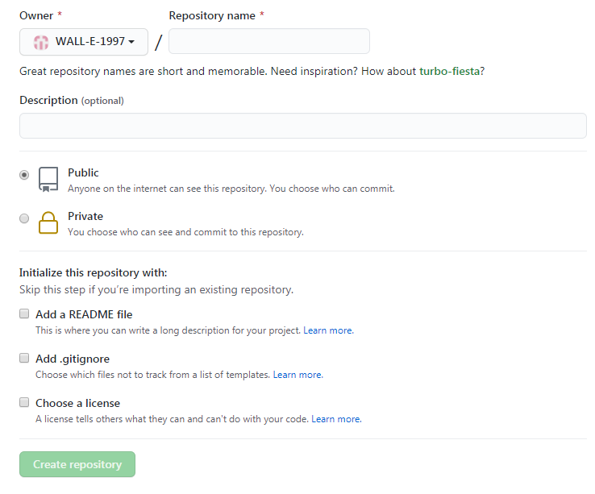

# 将本地文件添加到远程github仓库的分支

## 目标

在本地文件中进行代码或笔记的编辑，编辑完成后提交到github仓库中，从而实现本地代码或笔记到云端。

## 操作步骤

### 1 新建仓库

在github中新建仓库，选择公开与否，不自动生成README file（网上说的，目前不知道为什么）

### 2 创建本地工作目录

即新建文件夹，创建工程或笔记

### 3 git操作

1. 创建新的git仓库

   在步骤2创建的文件夹路径中右键选择Git Bash here，输入git init并回车

   

2. 提交到暂存区

   输入git add *

3. 提交到head

   输入git commit -m“msg”

4. 指定远程github仓库地址

   输入git remote add origin git@github.com:WALL-E-1997/commitBranch.git

5. 提交到远程

   git push -u origin master

   

